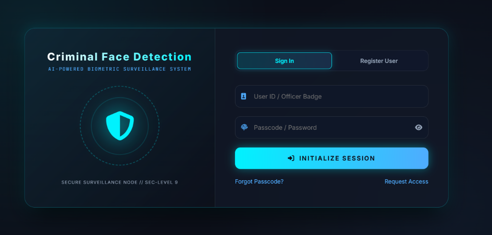
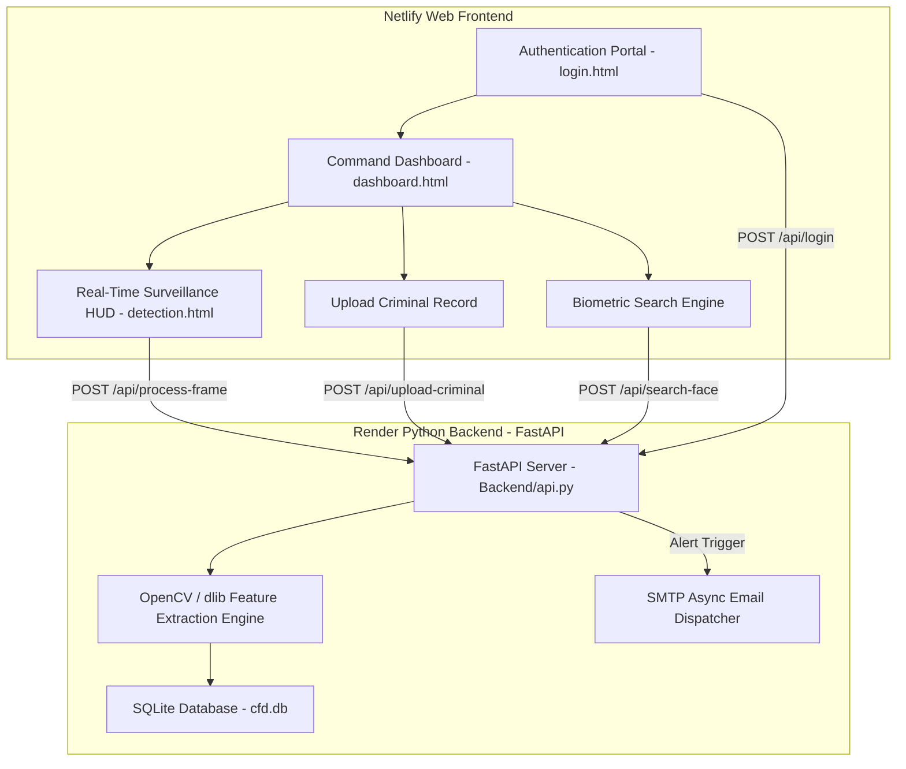

<div align="center">

  # 🛡️ CRIMINAL FACE DETECTION
  ### **AI-Powered Biometric Surveillance System**

  [](https://fastapi.tiangolo.com/)
  [](https://opencv.org/)
  [](https://render.com)
  [](https://netlify.com)
  [](https://sqlite.org/)

  <br />


</div>

---

## 🚀 Live Web App Demo

<div align="center">
  <a href="https://criminal-face-detection.netlify.app/" target="_blank" rel="noopener noreferrer">
    
  </a>
</div>

---

## 🔑 Test Demo Credentials

| Officer User ID | Passcode |
| :--- | :--- |
| **`user231`** | **`123456`** |

---

## 🔄 System Workflow & Architecture



---

## 🌟 Key Features

- 📹 **Real-Time Surveillance HUD**: Live camera stream monitoring with bounding box facial target tracking.
- 📁 **Criminal Record Upload**: Store facial encodings, offense details, and 12-digit Aadhaar numbers.
- 🔍 **Biometric Image Search**: Correlate query photos against stored database encodings with match accuracy scores.
- 🚨 **Instant Email Alerts**: Automatic async SMTP email notifications with attached capture photos upon match detection.
- 🧹 **Storage Auto-Cleanup**: Automatically purges temporary camera frame snapshots from disk on module exit.

---

## 🛠️ Tech Stack

- **Frontend**: HTML5, JavaScript (ES6+), Vanilla CSS3 (Cyber Dark Glassmorphism Design)
- **Backend**: Python 3.10, FastAPI, Uvicorn/Gunicorn
- **Computer Vision**: OpenCV (`opencv-python-headless`), HOG / dlib Feature Extractor, NumPy
- **Database**: SQLite3 (`cfd.db`)
- **Cloud Hosting**: Render (Backend API), Netlify (Web Frontend)

---

## 🚀 Quick Setup (Local Development)

### **1. Clone & Install**
```bash
git clone https://github.com/Chaithanyamandula/Criminal-Face-Detection.git
cd Criminal-Face-Detection
pip install -r requirements.txt
```

### **2. Launch Local API Server**
```bash
uvicorn Backend.api:app --host 0.0.0.0 --port 8000 --reload
```
