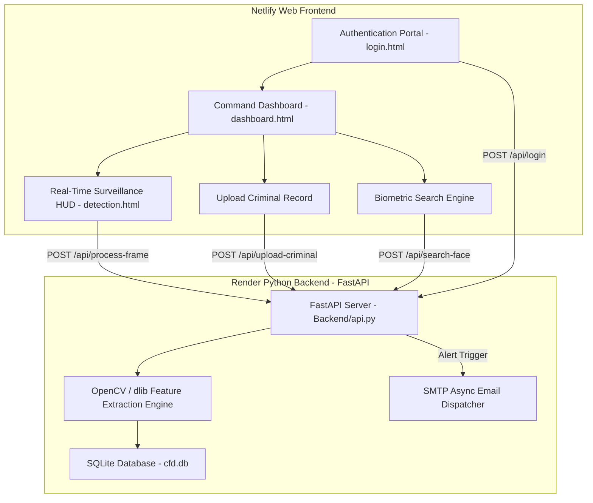

<div align="center">

  # 🛡️ CRIMINAL FACE DETECTION
  ### **AI-Powered Biometric Surveillance & Law Enforcement Command Center**

  [](https://fastapi.tiangolo.com/)
  [](https://opencv.org/)
  [](https://render.com)
  [](https://netlify.com)
  [](https://sqlite.org/)
  [](LICENSE)

  <br />

  [🌐 Live Backend API](https://criminal-face-detection-backend.onrender.com) • [📄 Project Documentation](#-table-of-contents) • [🔑 Test Credentials](#-test-demo-credentials)

</div>

---

## 📌 Table of Contents
- [🌟 Key Features](#-key-features)
- [🔑 Test Demo Credentials](#-test-demo-credentials)
- [🎨 System Architecture & Design](#-system-architecture--design)
- [🛠️ Tech Stack](#️-tech-stack)
- [🖥️ Module Breakdown](#️-module-breakdown)
- [🚀 Quick Start (Local Setup)](#-quick-start-local-setup)
- [☁️ Cloud Deployment Guide](#️-cloud-deployment-guide)
- [🛡️ Security & Privacy](#️-security--privacy)
- [👨‍💻 Author & License](#-author--license)

---

## 🌟 Key Features

- **🎥 Real-Time Facial Surveillance HUD**: Live web camera feed processing with bounding box target tracking, continuous match identification, and timestamped exit tracking.
- **📁 Criminal Profile & Aadhaar Encoding**: Secure form to register criminal records, store detailed offense descriptions, 12-digit Aadhaar numbers, and 128D facial encodings.
- **🔍 Biometric Correlative Search**: Upload any photo to query against the SQLite database, returning criminal profiles with a dynamic **Match Accuracy Gauge**.
- **🚨 Instant Email Emergency Alerts**: Asynchronous SMTP dispatch sending real-time email notifications with attached snapshot images upon high-confidence matches.
- **🧹 Storage Auto-Purge**: Automated background cleanup purging temporary webcam frame captures from `criminal_captures/` and `temp/` folders whenever navigating between modules or logging out.
- **🎨 Futuristic Cyber UI**: Glassmorphism dark command center design featuring glowing cyan accents (`#00F2FE`), responsive hover-expandable navigation rail, and dynamic telemetry widgets.

---

## 🔑 Test Demo Credentials

You can test the live application using any of the pre-configured officer credentials below:

| Officer User ID | Default Passcode | Access Level | Authorized Role |
| :--- | :--- | :--- | :--- |
| `user231` | `123456` | Level 9 Command | Senior Surveillance Officer |
| `user261` | `123456` | Level 9 Command | Biometric Analyst |
| `user253` | `123456` | Level 9 Command | Cyber Crime Unit |
| `user241` | `123456` | Level 9 Command | Field Operative |
| `user` | `123456` | Standard | System Operator |
| `admin` | `123456` | Root | System Administrator |

> [!NOTE]  
> New officer credentials can also be created dynamically using the **"Register User"** tab on the Login Screen.

---

## 🎨 System Architecture & Design



---

## 🛠️ Tech Stack

### **Frontend (Netlify)**
- **Structure**: HTML5, Modern Vanilla JS (ES6+)
- **Styling**: Vanilla CSS3, Glassmorphism, CSS Grid/Flexbox, FontAwesome 6, Google Fonts (*Inter*, *JetBrains Mono*)
- **Communication**: Dynamic RESTful `fetch()` client with dynamic fallback for local Eel desktop mode

### **Backend (Render)**
- **Framework**: FastAPI (Python 3.10)
- **Computer Vision**: OpenCV (`opencv-python-headless`), `dlib` / HOG Feature Extractor, `numpy`
- **Database**: SQLite3 (`cfd.db`)
- **Server**: Uvicorn / Gunicorn ASGI
- **Notification Service**: Asynchronous SMTP (Gmail TLS)

---

## 🖥️ Module Breakdown

### 1. **Biometric Authentication Portal (`login.html`)**
- High-tech Cyber Command login card with glowing cyan inputs.
- Dual-mode tab switcher (**Sign In** vs. **Register User**).
- SHA-256 password verification against `users` table in `cfd.db`.

### 2. **Command Dashboard (`dashboard.html`)**
- **Hover Expandable Navigation Rail**: Compact 76px icon rail expanding smoothly to 250px on cursor hover.
- **Telemetry Bar**: Active encodings, daily detection counters, active feeds status.
- **Upload Form**: Multi-file dropzone, 12-digit Aadhaar input validator, offense categorizer.

### 3. **Real-Time Surveillance HUD (`detection.html`)**
- Standard 640x480 webcam viewport with target reticle brackets.
- Pulsing red danger banner triggering upon high-confidence criminal matches.
- Live Detection History Log table showing spotted time, exit status, and zoomable thumbnail snapshots.

---

## 🚀 Quick Start (Local Setup)

### **Prerequisites**
- Python 3.10 or higher
- Git

### **Installation**

1. **Clone the Repository**:
   ```bash
   git clone https://github.com/Chaithanyamandula/Criminal-Face-Detection.git
   cd Criminal-Face-Detection
   ```

2. **Install Dependencies**:
   ```bash
   pip install -r requirements.txt
   ```

3. **Run Locally**:
   - **FastAPI Web API Mode**:
     ```bash
     uvicorn Backend.api:app --host 0.0.0.0 --port 8000 --reload
     ```
     Access frontend by opening `web/login.html` in your browser.

   - **Eel Desktop App Mode**:
     ```bash
     python Backend/main.py
     ```

---

## ☁️ Cloud Deployment Guide

### **Backend Deployment (Render)**
1. Connect your GitHub repository to **Render**.
2. Environment: `Python 3`
3. Build Command: `pip install -r requirements.txt`
4. Start Command: `uvicorn Backend.api:app --host 0.0.0.0 --port $PORT`

### **Frontend Deployment (Netlify)**
1. Connect your GitHub repository to **Netlify**.
2. Base directory: `web`
3. Build command: *(leave blank)*
4. Publish directory: `.`

---

## 🛡️ Security & Privacy

- **Data Protection**: Facial encodings are serialized as 128D mathematical floating-point blobs (`pickle`) stored locally in SQLite (`cfd.db`), ensuring original images are not exposed.
- **Storage Hygiene**: Captures generated during real-time surveillance are automatically deleted upon module navigation or session termination.
- **CORS Restricted**: API endpoints enforce strict CORS control for cross-origin security.

---

## 👨‍💻 Author & License

Developed with ❤️ by **Chaithanyamandula**.

Distributed under the **MIT License**. See `LICENSE` for more information.
